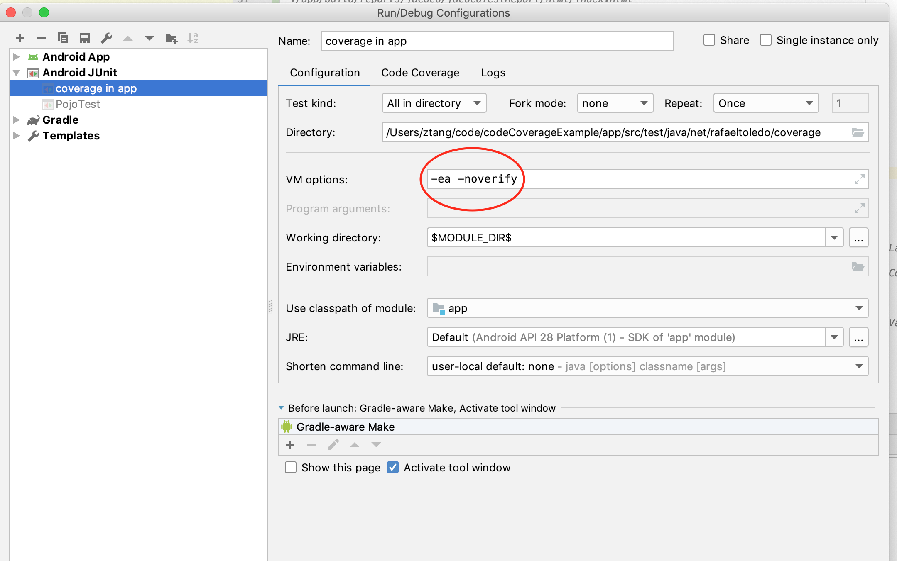

# Unified Code Coverage for Android

A sample project showcase of how to merge the coverage data from both `androidTest` and `test`.

[Java Example](https://github.com/rafaeltoledo/unified-code-coverage-android/)

[Kotlin Example](https://github.com/rafaeltoledo/unified-code-coverage-android/tree/kotlin-coverage)

[Java+Kotlin Example](https://github.com/rafaeltoledo/unified-code-coverage-android/tree/mixed-languages)

=============

[Blog Post](https://medium.com/@rafael_toledo/setting-up-an-unified-coverage-report-in-android-with-jacoco-robolectric-and-espresso-ffe239aaf3fa) (en-US)
[Another Blog Post](https://proandroiddev.com/unified-code-coverage-for-android-revisited-44789c9b722f) (en-US)

[Blog Post](https://medium.com/android-dev-br/gerando-o-relat%C3%B3rio-de-cobertura-de-testes-unificado-com-jacoco-robolectric-e-espresso-c5f110dbf94f) (pt-BR)


## How to run in the easy way :

Just execute the script that I have created

`sh ./report.sh`

###Warning : You are required to connect a Android device or
emulator because there will be android test included in this command.

The following command is the one to execute your test case and generate the result.

`./gradlew clean jacocoTestReport`

The default result will be put under the following path.

`./app/build/reports/jacoco/jacocoTestReport/html/index.html`

Given the facts that I really hate to browse directory deeply to find something, so I write a script
to copy the report under the project build folder and open the result within your default browser.

(You are welcome)

## Why the coverage is not 100%?
I added a dummy method specifically to demonstrating what happens
if you miss a method.You could safely remove it to make 100% as you wish.


## Trouble shooting
In case you run into this kind of error when you run the test suite, please add 
`-ea -noverify`



to the VMOptions in the test. For more information, please refer to
[this thread](https://github.com/robolectric/robolectric/issues/3023#issuecomment-397166230)

```java.lang.VerifyError: Bad return type
 Exception Details:
   Location:
     android/content/res/ResourcesImpl.$$robo$$loadComplexColorForCookie(Landroid/content/res/Resources;Landroid/util/TypedValue;ILandroid/content/res/Resources$Theme;)Landroid/content/res/ComplexColor; @565: areturn
   Reason:
     Type 'java/lang/Object' (current frame, stack[0]) is not assignable to 'android/content/res/ComplexColor' (from method signature)
   Current Frame:
     bci: @565
     flags: { }
     locals: { 'android/content/res/ResourcesImpl', 'android/content/res/Resources', 'android/util/TypedValue', integer, 'android/content/res/Resources$Theme', 'java/lang/Object', 'java/lang/String', 'java/lang/Object', 'android/content/res/XmlResourceParser', 'android/util/AttributeSet', integer, 'java/lang/String' }
     stack: { 'java/lang/Object' }
   Bytecode:
     0x0000000: 127c b800 823a 0519 0511 041b b800 862c
     0x0000010: b401 a9c7 002a 1905 1104 1cb8 0086 bb04
     0x0000020: 2859 bb01 1b59 b701 1c13 042a b601 222c
     ```